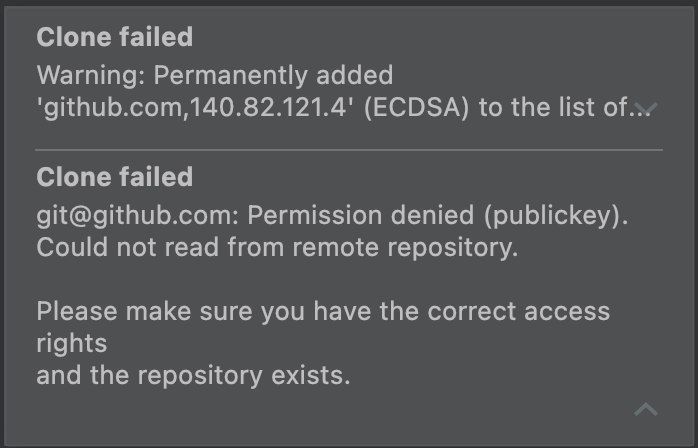

# onboarding-jdk-homework
Домашние задания для учеников по программе курса

## Как работать с этим проектом ?
### 1. Нажми кнопку `Fork` справа вверху

### 2. Отлично! Создалась копия проекта на личной странице
### 3. Теперь нажми на зеленую кнопку `Code` и скопируй предложенную ссылку SSH
- Например `git@github.com:your_name/onboarding-jdk-homework.git`, _где your_name твой username_

### 4. Склонируй новый проект в IDEA

### 5. Появилась ошибка авторизации ?

### 6. Без паники :exclamation: GitHub защищается от неавторизованных действий и предлагает создать ключ
- Создаем ключ - [Инструкция создания ключа](https://docs.github.com/en/authentication/connecting-to-github-with-ssh/generating-a-new-ssh-key-and-adding-it-to-the-ssh-agent)
- В итоге создались два файла в директории `~/.ssh/`
- Сохраняем публичный ключ в github - [Инструкция сохранения ключа](https://docs.github.com/en/authentication/connecting-to-github-with-ssh/adding-a-new-ssh-key-to-your-github-account)
- Клонируем проект заново - [Начинаем с пункта №3](#3-теперь-нажми-на-зеленую-кнопку-code-и-скопируй-предложенную-ссылку-ssh)
### 7. Теперь ты можешь полноценно работать и выполнять домашнее задание :clap:

## Приступаем к домашнему заданию
### 1. Нажимаем на кнопку в IDEA справа внизу с названием текущей ветки
### 2. Создаем отдельную ветку со своим именем от ветки с названием темы
- например новая ветка `algorithms_your_name` от ветки `origin/algorithms`, _где your_name твой username_

