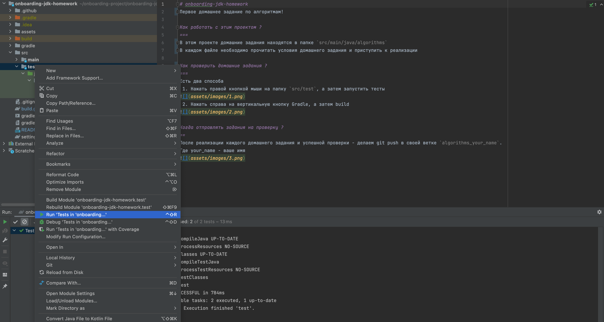
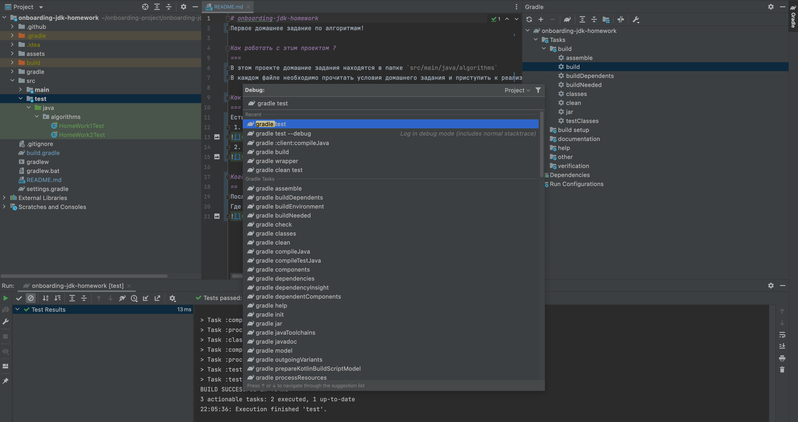
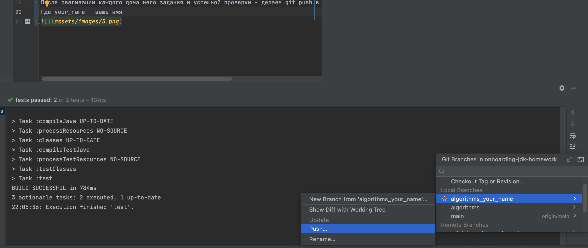

# onboarding-jdk-homework
Первое домашнее задание по алгоритмам!

Как работать с этим проектом ?
===
В этом проекте домашние задания находятся в папке `src/main/java/algorithms`
В каждом файле необходимо прочитать условия домашнего задания и приступить к реализации

Как проверить домашние задания ?
===
Есть два способа
 1. Нажать правой кнопкой мыши на папку `src/test`, а затем запустить тесты

 2. Нажать справа на вертикальную кнопку Gradle, а затем build
 

Когда отправлять задания на проверку ?
==
После реализации каждого домашнего задания и успешной проверки - делаем git push в своей ветке `algorithms_your_name`.
Где your_name - ваше имя
