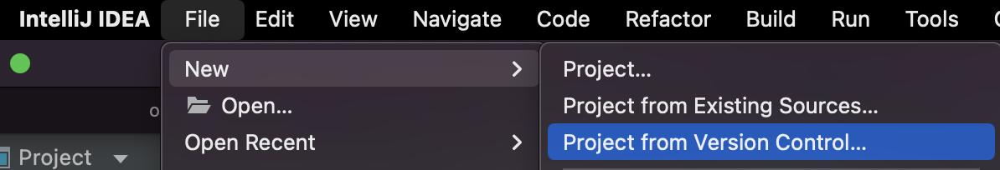
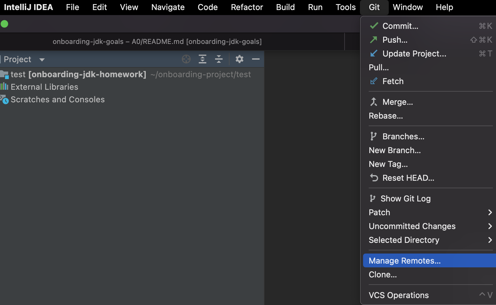
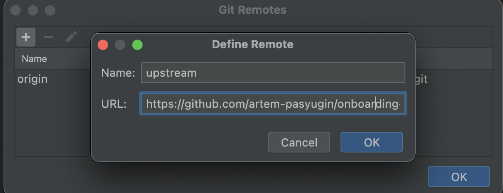
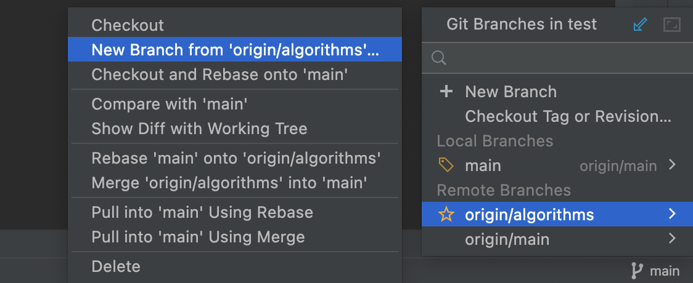
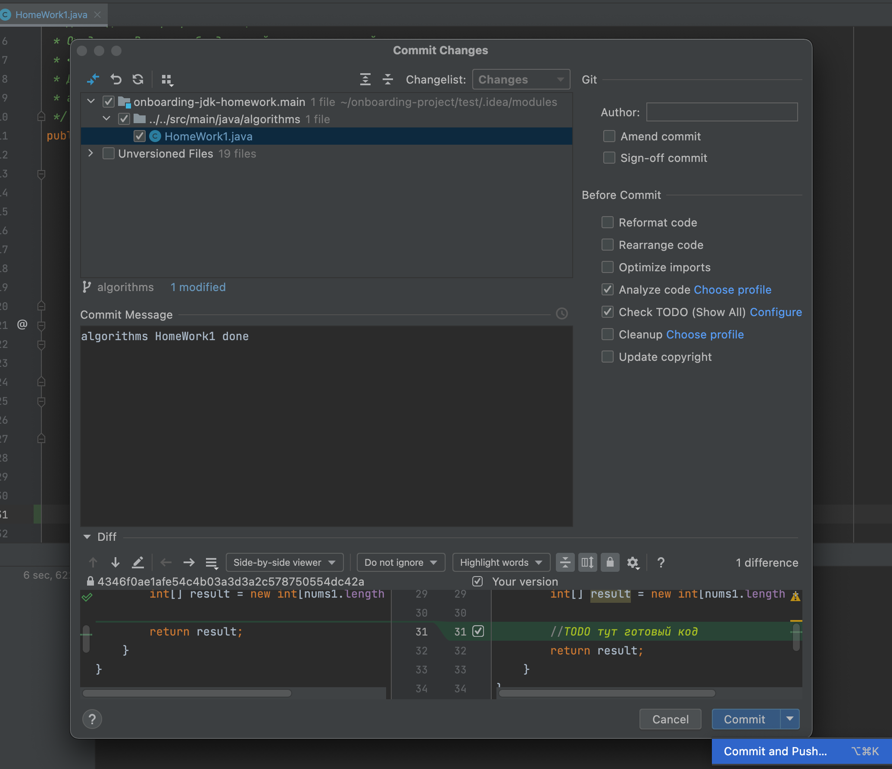
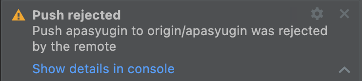
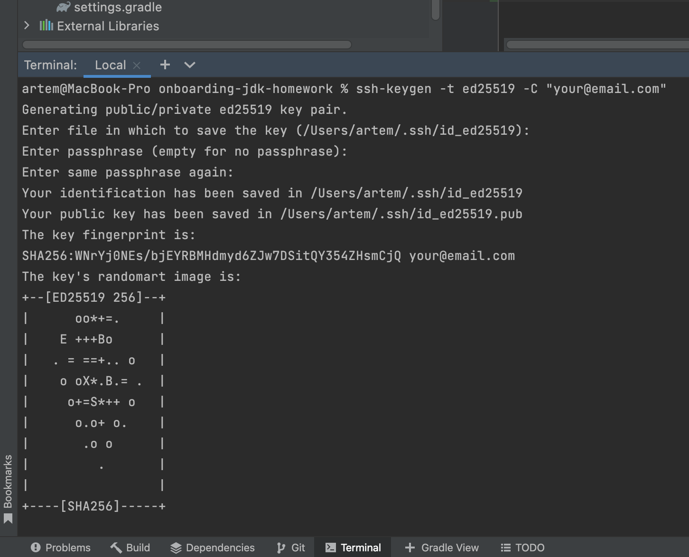
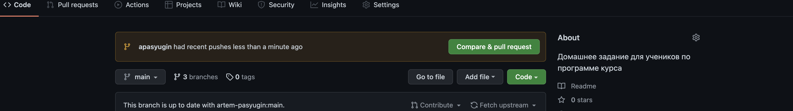

# onboarding-jdk-homework
Домашние задания для учеников по программе курса

Как работать с этим проектом ?
===
### 1. Нажми кнопку `Fork` справа вверху

### 2. Отлично! Ты создал собственную копию проекта на своей странице
### 3. Теперь нажми на зеленую кнопку `Clone` и скопируй предложенную ссылку SSH
например `git@github.com:...`
### 4. Склонируй новый проект в IDEA

### 5. Вставь предложенную ссылку из 3 пункта в поле `URL` и нажми кнопку `Clone`
### 6. Выбери `New Window`
### 7. В новом окне перейди в настройки Git
- Нажми `Manage Remotes...`

### 8. Вставь ссылку и нажми `OK`
- `https://github.com/artem-pasyugin/onboarding-jdk-homework`

### 9. Теперь ты можешь полноценно работать и выполнять домашнее задание :clap:

Приступаем к домашнему заданию
===
### 1. Нажимаем на кнопку в IDEA справа внизу с названием текущей ветки
### 2. Создаем отдельную ветку со своим именем от ветки с названием темы
- например новая ветка `apasyugin` от ветки `origin/algorithms`

 
### 3. Выполняем домашнее задание
### 4. Делаем коммит 
- Нажимаем на зеленую галочку

### 5. Делаем пуш
- Заполняем `Commit Message` и нажимаем `Commit and Push...`

### 6. Появилась ошибка авторизации ?

### 7. Без паники :exclamation: GitHub защищается от неавторизованных действий и предлагает создать ключ
### 8. Открываем терминал в IDEA (внизу на панели)
> ssh-keygen -t ed25519 -C "your@email.com"
- меняем только `your@email.com` - нажимаем все время enter до принта !

### 9. Заходим и выполняем все пункты - [Инструкция сохранения ключа](https://docs.github.com/en/authentication/connecting-to-github-with-ssh/adding-a-new-ssh-key-to-your-github-account)
### 10. Теперь ты можешь полноценно сделать 5 пункт и увидеть свои изменения на своей странице в GitHub :clap:

Отправляем домашнее задание на проверку
===
### 1. После выполнения домашнего задания и успешного пуша - заходим на свою страницу в GitHub 
- Видим предложение о создании pull request!

### 2. Нажимаем `Compare & pull request`
### 3. Устанавливаем base ветку с задачей 

### 4. Нажимаем `Create pull request`
### 5. Получаем успех! Теперь твое задание отправилось на проверку :clap: