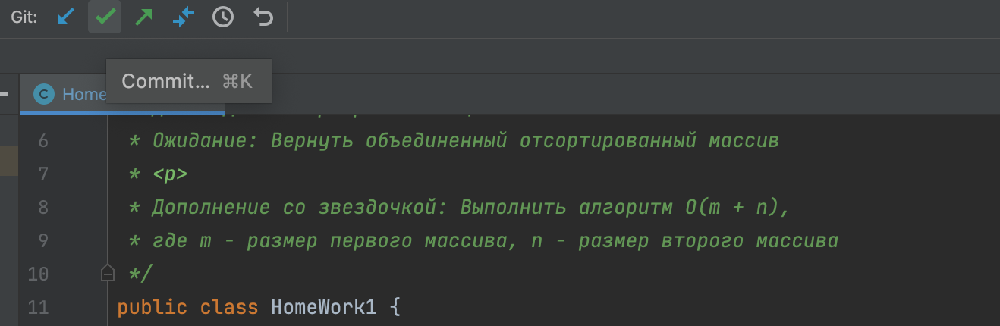
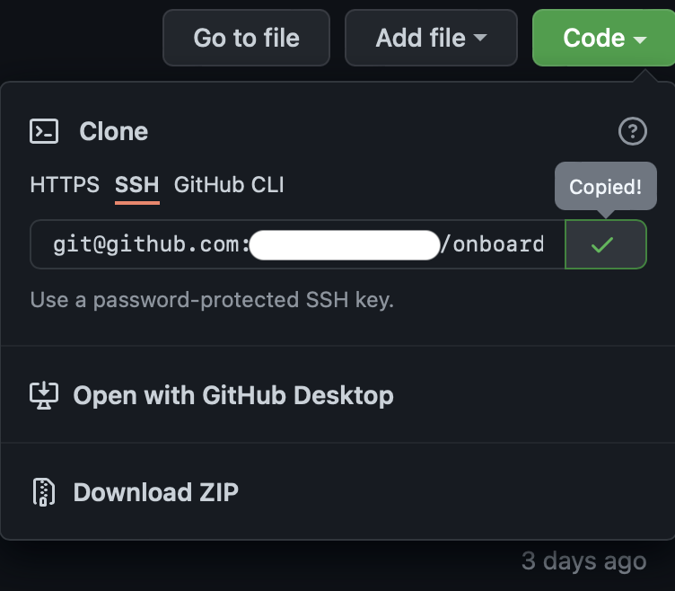
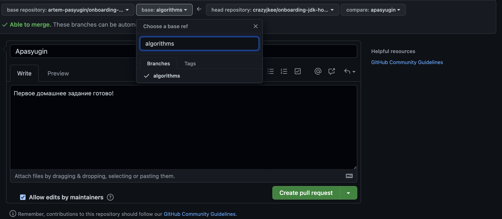

# onboarding-jdk-homework

## Приступаем к домашнему заданию
### 1. Выполняем домашнее задание
### 2. Делаем коммит
- Нажимаем на зеленую галочку

### 3. Делаем пуш
- Заполняем `Commit Message` и нажимаем `Commit and Push...`

### 4. Теперь ты можешь увидеть изменения на своей странице в GitHub :clap:

# Отправляем домашнее задание на проверку
## 1. После выполнения домашнего задания и успешного пуша - заходим на свою страницу в GitHub
- Видим предложение о создании pull request!

### 2. Нажимаем `Compare & pull request`
### 3. Устанавливаем base ветку с задачей

### 4. Нажимаем `Create pull request`
### 5. Получаем успех! Теперь твое задание отправилось на проверку :clap: