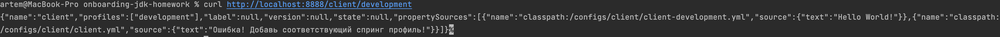

Первое домашнее задание
===

## Дано:

1) Config server в котором есть настройки для клиента `resources/configs/client/client.yml`
2) Запуск сервера на 8888 порте в этом классе нажатием на "Play" на 9 строке
   

## Ожидаемый результат:

1. Отправляем запрос через терминал `curl http://localhost:8888/client/development`
2. Ожидаем ответ
   